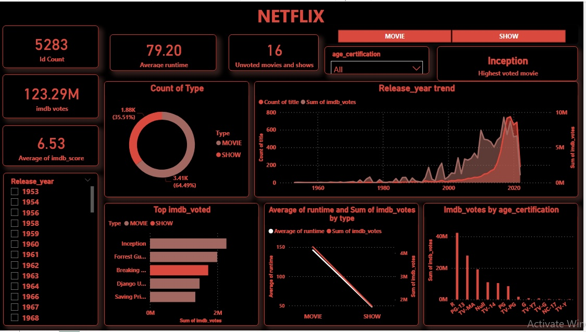

# NETFLIX SHOWS AND MOVIES IMDANALYSIS

## INTRODUCTION

Netflix, the powerhouse of streaming entertainment, offers a treasure trove of shows and movies spanning diverse genres. In this analysis, we dive into the vast Netflix catalog, leveraging IMDb scores and votes to unravel the preferences of audiences worldwide. By meticulously examining the data, we unveil the genre that reigns supreme, backed by both popular acclaim and critical acclaim. Join us as we navigate through the labyrinth of Netflix content, shedding light on the genre that captures the hearts and minds of viewers, one vote and score at a time.

## PROBLEM STATEMENT

Visualizing ratings, genres, and trends to derive insights into viewer preferences presents a critical challenge in the entertainment industry. The objective is to develop an effective visualization tool that can analyze these key factors to uncover patterns and preferences among viewers. By examining ratings, genres, and trends in a visually accessible format, the tool aims to better understand viewers preferences

## SKILLS

1. Data transformation
2. Query editor
3. Slicers
3. Data visualization.

## PROCESS

1. *Data Import:* Data was imported from CSV source into Power BI.

2. *Data Cleaning and Transformation:* The imported data was cleaned and transformed using Power Query Editor. This involved tasks such as removing duplicates, filtering rows, correcting data types, handling missing values, and performing other data cleansing operations to ensure data accuracy and consistency.

3. *Dashboard Creation:* Dashboards were designed to present key metrics and insights in a visually appealing and interactive manner. This involved arranging visualizations, adding slicers or filters for interactivity, and configuring the layout to convey information effectively.

By performing these steps, the data was prepared, transformed, and organized in Power BI to facilitate meaningful analysis and visualization, leading to the creation of insightful dashboards and reports.

[Click here](https://github.com/AmaPrecious/NETFLIX_ANALYSIS/blob/main/Task%201-%20Netflix%20TV%20Shows%20and%20Movies.csv)to gain access to the raw dataset.

## Visualization

 

## RESULTS AND FINDINGS

 ### Netflix Shows and Movies IMDb Analysis

- *Total Entries:* 5283
- *Unvoted Entries:* 16
- *Total IMDb Votes:* 123.29 million
- *Average IMDb Score:* 6.53
- *Average Runtime:* 79.20 minutes

#### Highest Voted Entries:
1. Inception: 2,268,288 votes
2. Forrest Gump: 1,994,599 votes
3. Breaking Bad (Show): 1,727,694 votes

#### Distribution by Type:
- Movies: 3,407 (64.49%)
- Shows: 1,876 (35.51%)

#### Year with Highest Votes:
- 2017: 555 total entries, 9,284,143 votes

#### Year with Lowest Votes:
- 1953: 1 entry, 231 votes

#### Age Certification:
- R rated movies had the highest votes: 42,344,416

Click here]([)](https://github.com/AmaPrecious/NETFLIX_ANALYSIS/blob/main/Netflix_Analysis.pbix)to gain access to the interactive dashboard.

## Conclusion:

The analysis of IMDb scores, votes, and other parameters offers valuable insights into viewer preferences on Netflix. With a vast catalog comprising predominantly movies, it's evident that certain titles like Inception and Forrest Gump have captured audiences' attention significantly. The year 2017 stands out with the highest number of releases and votes, indicating a vibrant period for Netflix content. Additionally, the dominance of R-rated movies in terms of votes suggests a specific demographic preference. Overall, this analysis provides valuable data for understanding viewer behavior and guiding content strategies on the platform.
